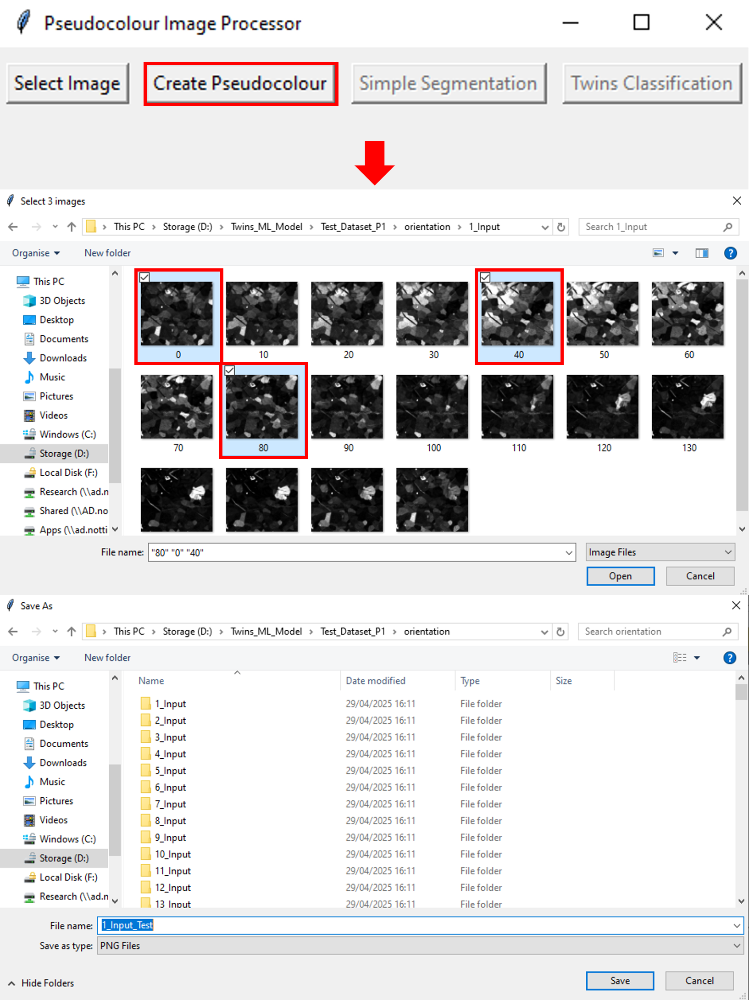
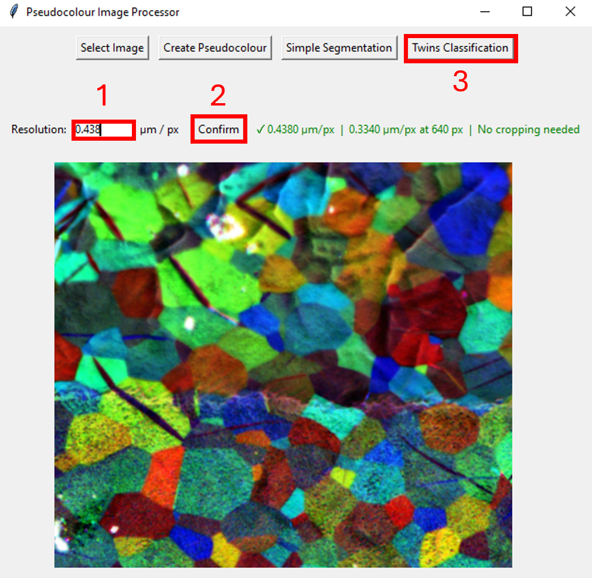
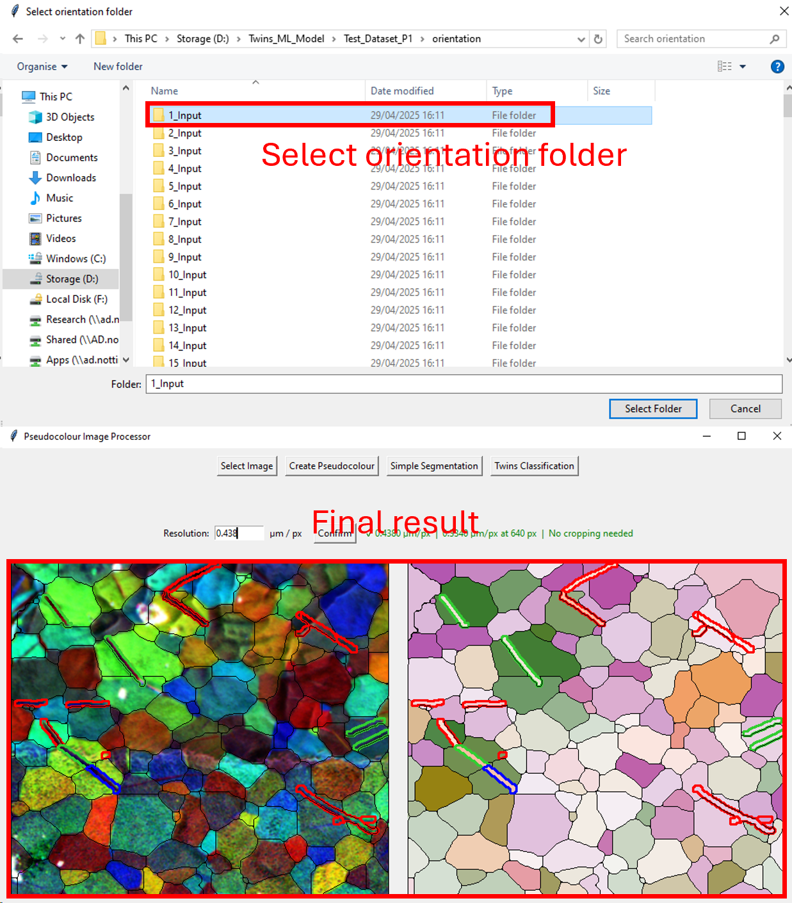

# PLM ML Twins Classification

## Overview
A machine learning application for twins classification and grain segmentation using deep learning models, with a user-friendly GUI interface.

## Publication

Please read the publication at https://www.sciencedirect.com/science/article/pii/S2590049826001566 to understand more about the work. 


## Project Overview

This project provides tools for analyzing metallic microstructures, specifically focusing on:
- **Twins Classification**: Identifying and classifying twin boundaries in crystalline materials
- **Grain Segmentation**: Segmenting individual grains within EBSD (Electron Backscatter Diffraction) images
- **Pseudocolour Image Processing**: Converting and processing orientation maps into pseudocolour images for better visualization

## Features

- **Interactive GUI**: User-friendly Tkinter-based interface for image processing
- **Image Processing Capabilities**:
  - Load and display pseudocolour images (PNG, JPG, JPEG formats)
  - Create pseudocolour images from orientation data
  - Simple grain segmentation using contour detection
  - Advanced twins classification with PLM (Polarized Light Microscopy) mapping
- **Deep Learning Models**: YOLOv8-based models for accurate segmentation and classification
- **Real-time Visualization**: Side-by-side display of segmentation results and PLM maps

## Installation
To set up the project on your local machine, follow these steps:

1. Clone the repository:
  ```
   git clone https://github.com/girerdth/PLM_ML_Twins_Classification.git
   cd PLM_ML_Twins_Classification
  ```

2. Install the necessary dependencies:
```
  pip install -r requirements.txt
```
## Usage
### Running the Application
Execute the main script to launch the GUI:
```
python Twins_Classification.py
```
### GUI Features
The application provides four main buttons:
1. Select Image: Open a file dialog to load a pseudocolour image
2. Create Pseudocolour: Convert the selected images to pseudocolour representation (We recommend to select 0 degree, 40 degrees and 80 degrees)
3. Simple Segmentation: Perform basic grain segmentation
4. Twins Classification: Run advanced twins classification with PLM mapping

### Workflow
1. Click "Select Image" to load a pseudocolour image (PNG/JPG/JPEG) or Click "Create Pseudocolour" to generate pseudocolour visualization from PLM images
2. Choose either:
    - "Simple Segmentation" for basic grain boundary detection.
    - "Twins Classification" for advanced analysis with PLM mapping. Will show results in the side-by-side display panels.
3. If you select "Twins Classification", you will need to give a folder for the corresponding image where you have stored the 18 images (or 36) for the different orientation angles. You will need to register your images. 

### Example for Twins Classification

1. First step, after clicking on "Create Pseudocolour", 3 greyscale images needs to be selected and then, the name of the pseudocolour image needs to be saved. 

2. Resolution in µm/px needs to be entered. The image is resize to 640 pixels and the new resolution is measured to make sure it is below the threshold of the ML model.

3. Finally, if "Twins Classification" is selected, the orientation folder where all the greyscale images are stored needs to be selected and the final result will be displayed. 
 

### Project Structure
```Code
PLM_ML_Twins_Classification/
├── Twins_Classification.py    # Main GUI application
├── Terminal_method.py         # Terminal-based processing methods
├── requirements.txt           # Python dependencies
├── source_code/
│   ├── pseudoimage.py        # Pseudocolour image generation
│   └── run_models.py         # ML model execution (simplify & amplify methods)
├── data/                      # Input data directory
├── models/                    # Pre-trained ML models
├── files/                     # Processing output files
├── runs/                      # Training/inference runs
└── .idea/                     # IDE configuration
```
## Key Dependencies
### Core Libraries

tkinter: GUI framework (built-in with Python)

OpenCV (cv2): Image processing

Pillow: Image display in GUI

NumPy: Numerical operations

SciPy: Scientific computing

### Machine Learning

PyTorch: Deep learning framework

Ultralytics YOLOv8: Object detection and segmentation models

scikit-image: Advanced image processing

### Materials Science

ORIX: Crystallographic orientation analysis

diffpy.structure: Crystal structure handling

scikit-learn: Machine learning utilities

## Technical Details

### Main Components
1. App Class: Manages the GUI and user interactions
- Image loading and display
- Pseudocolour generation
- Segmentation execution
2. pseudoimage Module: Handles pseudocolour image creation
- Color mapping from orientation data
- Image enhancement
3. run_models Module: Executes ML inference
- simplify_method: Basic segmentation
- amplify_method: Advanced twins classification
### Image Processing Pipeline
1. Load EBSD image
2. Generate pseudocolour representation
3. Apply segmentation model
4. Overlay contours on original image
5. Display results with PLM mapping
   
## Requirements
All dependencies are listed in requirements.txt. Key versions:

Python >= 3.8

PyTorch 2.3.1

Ultralytics 8.2.51

OpenCV 4.11.0.86

NumPy 1.26.4

Pandas 2.3.1

Matplotlib 3.10.3

scikit-image 0.25.2

## Author
Thomas Girerd

Created: February 10, 2026

